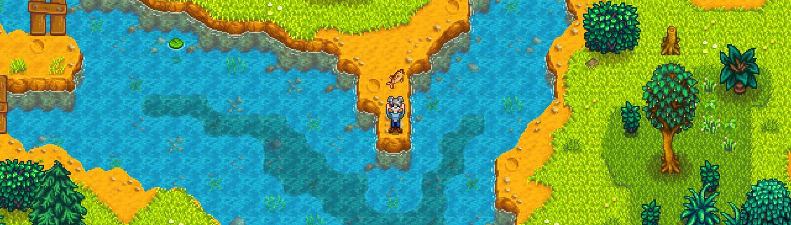

# StardewMods

This repository is a collection of everything I've created in relation to [Stardew Valley](https://www.stardewvalley.net/) modding using [SMAPI](https://smapi.io/). Here you can find my mods, tools, tutorials, templates, and other resources.

## Downloads

All mod releases can be found on [NexusMods][nexusmods], [CurseForge][curseforge], and [GitHub][gh-releases]. Detailed download instructions can be found on their respective pages.

## Documentation

Documentation for mods, as well as tutorials, can be found on the [website][website].

## Compiling

To use this repository locally, please refer to the [compile instructions](./docs/compiling.md).

## Mods

<!-- TODO: list of highlighted mods -->

## Tools

<!--TODO: describe tooling projects-->

## Templates

<!-- TODO: describe template projects -->

## Translations

English is the only language fully supported by me, and guaranteed to be up to date.
A fair few mods, made by other mod authors, do have built-in (partial) support for multiple languages.
This is not the case for any of my mods, meaning that if you want to use the mod in another language, someone else
needs to have published them; or you have to create them yourself.

Thanks to some of the players in the community, a few of my mods have been translated.
You can find them under the "Translations" tab on NexusMods.
Do note that these may not always be up to date, or accurate, as I'm not involved in making them.

If you find there are no translations for your language for a mod you're using, or the translations you've found are
outdated, you're free to [create and publish your own][translation-tutorial].

If you're curious why I do translations different than most, you can read [my stance on translations][stance-on-translations].

## Contributing

If you'd like to help in the development of a mod, or tool, or translate a mod, please read how you can
[contribute](./.github/CONTRIBUTING.md).

## Support

See [SUPPORT.md](./.github/SUPPORT.md) for information on how to get help.

## Contact

See [SUPPORT.md](./.github/SUPPORT.md#contact) for my contact information.

## Acknowledgements

<!--TODO: acknowledgements-->

## Licensing

Copyright © 2024-2025 Dunc4nNT

This repository is licensed under the Mozilla Public License 2.0 (MPL 2.0). See [LICENSE](./LICENSE) for more
information.

[nexusmods]: https://next.nexusmods.com/profile/NeverToxic/mods
[curseforge]: https://www.curseforge.com/members/nevertoxic/projects
[gh-releases]: https://github.com/Dunc4nNT/StardewValleyModding/releases
[website]: https://dunc4nnt.github.io/StardewValleyModding
[translation-tutorial]: https://dunc4nnt.github.io/StardewValleyModding/tutorials/contributing-to-translations
[stance-on-translations]: https://dunc4nnt.github.io/StardewValleyModding/posts/2025-07-04-my-stance-on-translations
