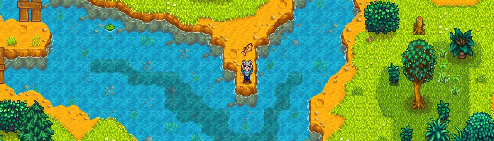

# Yet Another Fishing Mod

Having difficulty fishing? Or finding it too easy? This is yet another mod that allows you to adjust various fishing-related options.

## Table of Contents

- [Prerequisites](#prerequisites)
- [Installation](#installation)
- [Configuration](#configuration)
  - [General](#general)
  - [Attachments](#attachments)
  - [Enchantments](#enchantments)
- [How to Use](#how-to-use)
- [Compatibility](#compatibility)
- [Translations](#translations)
- [Contact](#contact)
- [Links](#links)
- [To Do](#to-do)
- [Licensing](#licensing)

## Prerequisites

Mandatory and optional requirements for use of this mod.

- [SMAPI 4.0](https://www.nexusmods.com/stardewvalley/mods/2400) (required)
- [GMCM 1.12][GMCM-nexus] (optional, but highly recommended)

## Installation

1. Download and install the required prerequisites.
2. Download the latest version of this mod through [NexusMods](https://www.nexusmods.com/stardewvalley/mods/20391?tab=files) or [GitHub releases](https://github.com/Dunc4nNT/StardewMods/releases).
3. Unzip the downloaded file into the `Stardew Valley/Mods` directory.
4. Launch the game using SMAPI.

## Configuration

The mod's configurable options can be found below. These can either be adjusted through [Generic Mod Configuration Menu (GMCM)][GMCM-nexus] or the `config.json` file. Editing the options using GMCM is recommended. GMCM will also provide descriptive tooltips if the option itself is not clear.

### General

- Increase Chance of Catching Fish (Nearly guarantee catching fish in locations you can catch things other than trash)
- Instantly Catch Fish (Skip fishing minigame)
- Instantly Catch Treasure (Automatically catches treasure for you, even if you missed it)
- Always Maximum Casting Power (Casts your line the maximum distance)
- Always Perfect
- Adjust how often treasure appears (vanilla, never or always)
- Always Catch Double
- Instant Bite
- Automatically Hook
- Automatically Loot Treasure
- Difficulty Multiplier
- Fish Quality
- Minimum Fish Quality (Is trumped by fish quality)

### Attachments

- Override Attachment Limit
- Reset Attachments
- Spawn Bait When Equipped
- Bait to Spawn
- Infinite Bait
- Spawn Tackle When Equipped
- Tackle to Spawn
- Infinite Tackle

### Enchantments

- Reset Enchantments
- Add All Enchantments
- Add Autohook Enchantment
- Add Efficient Tool Enchantment
- Add Master Enchantment
- Add Preserving Enchantment

## How to Use

Once you've configured the mod the way you want, simply equip a fishing rod and start fishing!

## Compatibility

This mod is made for **Stardew Valley 1.6** using **SMAPI 4.0**. This mod will **not** work on versions prior to those mentioned.

Both **singleplayer** and **multiplayer** should work. If you are having issues with multiplayer, make sure you've downloaded at least version 1.0.1 of the mod as this included a multiplayer hotfix.

I have yet to test **split screen**, but did try to make it compatible.

This mod does not change fish spawns, so it *should* work with mods adding **custom fish**.

*Should* be compatible with mods that add **custom bait and or hooks**, I've yet to test this, but as long as the category for the custom item was set correctly, this mod should detect them.

This mod will **not** work with **custom enchantments** at the moment. I'm looking to add support for this in the future.

Likely to conflict with mods that try to do the same thing. Due to every option in this mod being configurable it should not be likely to cause issues, as you can simply turn the conflicting option off. Though, feel free to report any mods that do conflict by [opening an issue][gh-issues], updating the README and [sending a pull request][gh-pr] or [comment on the NexusMods page][nexus-comments].

## Translations

Currently, only English is supported.

If you'd like another language to be supported and would like to help, please check the [modding translations wiki](https://stardewvalleywiki.com/Modding:Translations) and send a [pull request][gh-pr].

## Contact

**Having issues with installing or using the mod?** Leave a comment on the [NexusMods page][nexus-comments] detailing which steps you've done, which step you're failing at and if SMAPI is giving an error, please include a link to your [SMAPI log][smapi-log].

**Certain you've found a bug?** Please open an [issue][gh-issues] using the bug report template and add the appropriate mod label. If you prefer using Nexus, you can leave a report on the [bug reports page][nexus-bugs]. **Uncertain?** Leave a [comment][nexus-comments] first detailing what you've run into, including a link to your [SMAPI log][smapi-log]. **Know what you're doing?** Feel free to send a PR if you'd like.

**Like to request a new feature or addition to an existing feature?** Please open an [issue][gh-issues] using the feature request template and add the appropriate mod label.

**I may take a while to see a comment on nexus, you can try contacting me through Discord DMs or the SDV server (never.toxic) if that's the case, or incase of an urgent issue.**

## Links

- [NexusMods page for this mod](https://www.nexusmods.com/stardewvalley/mods/20391)
- [GitHub mono repo with all my mods](https://github.com/Dunc4nNT/StardewMods)

## To Do

List of things I'd like to add at some point. I'm uncertain how many of these I'll actually end up doing. List in no specific order.

- ~~Look into potential bug with the new bait (not catching 3 fish)~~ fixed in next release
- ~~Set InstantCatchTreasure to true by default~~ fixed in next release
- Look into difficulty value changing XP gained
- Rewrite attachment/enchantment logic
- Allow for custom enchantments
- Remove the "do add bait/tackle/enchantment" option and simply have a "None" option in the dropdown menu
- Allow 2 tackle slots (as per 1.6 content update)
- Allow users to set the amount of fish to catch (so allow a custom amount to be entered), make sure this works well with bait items so ideally have a "vanilla" option
- Have a percentage slider for the "always perfect" setting (as well as allowing vanilla settings)
- Have a percentage slider for the "catch treasure" setting (as well as allowing vanilla settings)
- Set instantly catch treasure to true by default
- Refund stamina on max cast option
- Skip treasure opening animation
- Reorganise GMCM options as some are vaguely worded and it's unclear what they do. Also possibly difficult to navigate once i add some of the above options as well
- Make sliders increment by values of say 0.05 so it's possible to set it back to 1.0 and not 1.00000001
- Look into an auto cast/recast option, configurable keybind for it as well
- Gradually learn catching fish, so say after catching 5 of a certain fish the amount of time it takes to catch the next one decreases, all the way till it's instant.
- Dutch translations
- Skip fish catch animation
- Automatically loot caught fish and trash

## Licensing

Copyright © 2024 Dunc4nNT

This project is licensed under the Mozilla Public License 2.0 (MPL 2.0). See [LICENSE](../LICENSE) for more information.

[GMCM-nexus]: https://www.nexusmods.com/stardewvalley/mods/5098
[nexus-comments]: https://www.nexusmods.com/stardewvalley/mods/20391?tab=posts
[nexus-bugs]: https://www.nexusmods.com/stardewvalley/mods/20391?tab=bugs
[smapi-log]: https://smapi.io/log
[gh-issues]: https://github.com/Dunc4nNT/StardewMods/issues
[gh-pr]: https://github.com/Dunc4nNT/StardewMods/pulls
