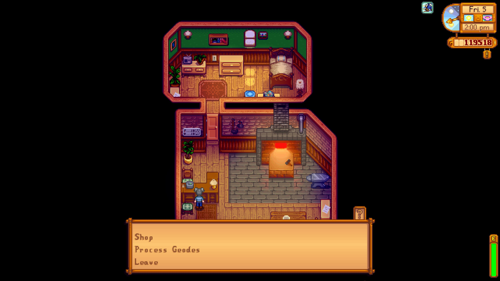

<!-- omit in toc -->
# Self Serve

Don't want to wait for shop owners like Marnie and Clint while they're gone? You no longer have to! Access any shop services even while its owner isn't attending it.

## Table of Contents

- [Table of Contents](#table-of-contents)
- [Prerequisites](#prerequisites)
- [Installation](#installation)
- [Configuration](#configuration)
- [How to Use](#how-to-use)
- [Compatibility](#compatibility)
- [Translations](#translations)
- [Contact](#contact)
- [Links](#links)
- [Credits](#credits)
- [Licensing](#licensing)

## Prerequisites

Mandatory and optional requirements for use of this mod.

- [SMAPI 4.0](https://www.nexusmods.com/stardewvalley/mods/2400) (required)
- [GMCM 1.12][GMCM-nexus] (optional, but highly recommended)

## Installation

1. Download and install the required prerequisites.
2. Download the latest version of this mod through [NexusMods](https://www.nexusmods.com/stardewvalley/mods/20985?tab=files) or [GitHub releases](https://github.com/Dunc4nNT/StardewMods/releases).
3. Unzip the downloaded file into the `Stardew Valley/Mods` directory.
4. Launch the game using SMAPI.

## Configuration

The mod's configurable options can be found below. These can either be adjusted through [Generic Mod Configuration Menu (GMCM)][GMCM-nexus] or the `config.json` file. Editing the options using GMCM is recommended. GMCM will also provide descriptive tooltips if the option itself is not clear.

- Pierre's General Store
- Willy's Fish Shop
- Ice Cream Shop
- Blacksmith
- Carpenter's
- Marnie's Animal Shop
- Hospital
- Stardrop Saloon Bar
- Bookseller's Shop
- Traveling Merchant
- Resort Bar
- Sandy's Oasis

## How to Use

Once you've configured the mod the way you want, simply go to a shop and interact with it!

## Compatibility

This mod is made for Stardew Valley 1.6 using SMAPI 4.0. This mod will **not** work on versions prior to those mentioned.

## Translations

English is the only language fully supported by me, and guaranteed to be up to date.

There are various languages that have translations available to download and use on NexusMods. Do note that these may not always be up to date, as I can't guarantee support for those languages myself.

If the language you'd like to see has no translation, or it's outdated, feel free to create your own translations and publish them as a mod translation on NexusMods. **Please only upload the translation file and nothing else.** You can either upload it inside of a `SelfServe/i18n/` folder or as just the file. For extra information, take a look at the [translation wiki](https://stardewvalleywiki.com/Modding:Translations).

Due to me not being able to guarantee whether other languages are up to date, I prefer they be uploaded separately from this mod (so a mod translation on NexusMods). For players this means you'll have to look at the "Translations" tab on Nexus and check if the language you speak is on there. For translators this means you'll have to publish your translations on Nexus and publish updates after new releases yourself.

If you have a question regarding translations (whether it's about how to translate, how to upload them etc), feel free to contact me any way.

## Contact

**In almost all cases** please leave a comment on the [NexusMods page][nexus-comments] detailing your issue. **Always** include a link to your [SMAPI log](smapi-log). **Without** this log it may be impossible for me to solve the problem you're having. If you prefer, you could send a DM on Nexus.

**Only after receiving permission**, may you try contacting me through Discord DMs or the SDV server (never.toxic). I likely won't respond otherwise.

## Links

- [NexusMods page for this mod](https://www.nexusmods.com/stardewvalley/mods/20985)
- [GitHub mono repo with all my mods](https://github.com/Dunc4nNT/StardewMods)

## Credits

This is a complete rewrite of the [Self Serve](https://www.nexusmods.com/stardewvalley/mods/11313) mod, made to be compatible with the Stardew Valley 1.6 update. Credit to [Aedenthorn](https://www.nexusmods.com/stardewvalley/users/18901754) for the original mod!

## Licensing

Copyright © 2024 Dunc4nNT

This project is licensed under the Mozilla Public License 2.0 (MPL 2.0). See [LICENSE](../LICENSE) for more information.

[GMCM-nexus]: https://www.nexusmods.com/stardewvalley/mods/5098
[nexus-comments]: https://www.nexusmods.com/stardewvalley/mods/20985?tab=posts
[nexus-bugs]: https://www.nexusmods.com/stardewvalley/mods/20985?tab=bugs
[smapi-log]: https://smapi.io/log
[gh-issues]: https://github.com/Dunc4nNT/StardewMods/issues
[gh-pr]: https://github.com/Dunc4nNT/StardewMods/pulls
